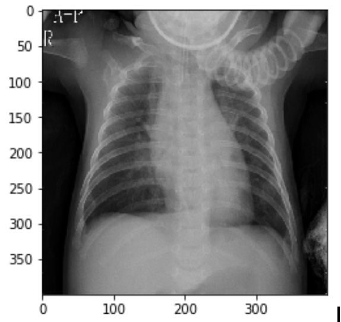

# Pneumonia-Detection-on-X-ray
## A classification project focusing on non-linear dimension reduction.

### 1. Description of the Problem
X-rays are widely used in medical diagnosis. Besides traditional evaluations by professional medical personnel, automatic diagnosis has an ever increasing role with the advancement of  technology. However, the tricky problem is that the X-rays images data usually have high resolution, which is highly time consuming for classification algorithms to perform. Under the assumption that the X-ray data is non-linearly distributed, non-linear dimension reduction methods as Isomap, Diffusion map and Laplacian map will be performed on the target dataset in order to better explore the natural distribution of the X-rays data.

### 2. Description of Dataset

The [X-rays dataset](http://dx.doi.org/10.17632/rscbjbr9sj.3) comes from a research named “Identifying Medical Diagnoses and Treatable Diseases by Image-Based Deep Learning” . There are two categories of data: ‘normal’ and ‘pneumonia’. The dataset consists of 5235 chest X-ray images with labels in training set and 627 chest X-ray images with labels in test set. All the images are resized into 400 * 400 gray scale format for easier manipulation. 

The [output.zip](https://drive.google.com/drive/folders/1p5W_IUamyiIPIkoiIPTffYo1pYlQUV1o?usp=sharing) file contains all the standardrized images(5856) in .jpeg format. All the images are gray scale and under 400*400 resolution. each image is named after their own index, e.g. 0.jpeg.

The [labels.txt](https://docs.google.com/document/d/14CV3MGRaM6YQ0g3Koom_Hw4I6YUK5uiM1_olNLkXpi8/edit?usp=sharing) file contains all the corresponding labels(5856). '0' means 'Normal' label and '1' means 'Pheumonia'.

For more details, pleast visit [our drive](https://drive.google.com/drive/folders/1PuuVBtkz96U_JZCxbApWByZqLyJsAo5a?usp=sharing).
